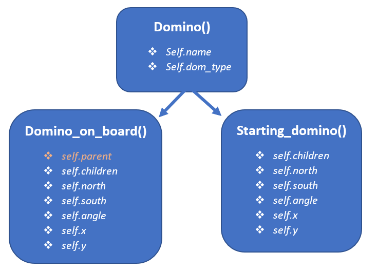
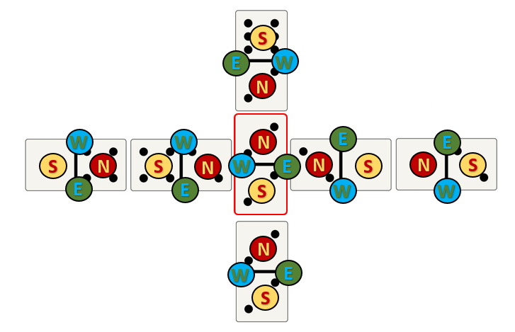
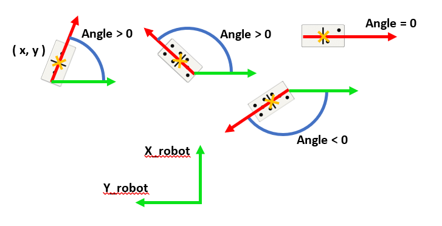
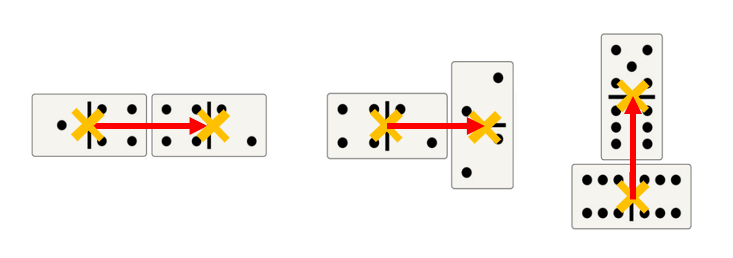
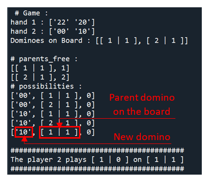

Robotics project : *Dobot Magician, Dominoes and Me* 🤖🦾🎲
======
This repo is the final project for the Fall 2019 Robotics course at NTU (National Taiwan University).
It aimed to teach a Dobot Magician robot arm to play dominoes with a human.
- A camera is used to take pictures of the board and to get the plays made by the human opponent. 
- The game is modeled by a finite state machine (FSM) representing the state at every step.
An approach with a custom ***decision tree*** was used to select the best strategy at every step. 

## I) Key Modules used

|                                    *Computer vision*                                    |                                   *Artificial Intelligence*                                    |                                                      *Robot Control*                                                      |
|:---------------------------------------------------------------------------------------:|:----------------------------------------------------------------------------------------------:|:-------------------------------------------------------------------------------------------------------------------------:|
|  |  |  |
|                                     OpenCV package                                      |                                  **Rule bases Decision Tree**                                  |                                                      PyDobot package                                                      | 
|                       Detect the dominoes and read the game state                       |                         Analyse the game state and find the best move                          |                                          Pick up, move and release the dominoes                                           |

## II) The result in video

## III) Theory

### a) Modelisation of the domino game

First a model of the game and every of its rules is proposed

### Creation of the object class **Domino()** :

The most adapted way to store the information about the dominoes was to
use the object-oriented programming. Each domino object has the
following information: *name* and *dom_type.* Name is a string
containing the numbers of the dominoes (ex: "63", "21","33" ...) and
*dom_type* can take the value "simple" or "double".

To define the connections between the dominoes, I use a
**children-parent storage system**. Indeed, each domino will have the
instances *parent* (Containing the name of its unique parent) and
*children* (A list of its children). Each domino has only one parent,
but he can have several children depending on its *dom_type* (cf.
figure 1) At this point it was also needed to make the difference
between the first domino put on the board (which one has no parent but
one more child) and the others. I then created two inheritance class of
the **Domino()** class : **Domino_on_board(Domino)** and
**Starting_Domino(Domino)** (cf. figure 4). To create a
**Starting_Domino**, we only need a name (ex: "21") and a
**Domino_on_board**, a name, a Domino() object corresponding to the
parent and the side of connection.

|                    | 
|:---------------------------------------------:| 
| Figure 0 : *Summary of the different classes* |

|                                           | 
|:-------------------------------------------------------------------:| 
| Figure 1 : *Example of connection if \"42\" is the Starting domino* |

### Definition of the North and South side :

I define the sides *north* and *south* to the following rules:

-   For the **Starting_domino,** north and south are arbitrarily
    decided.

-   For the **Domino_on_board,** the north is defined has the connection
    side for the simple dominoes and like the 90-degree oriented
    rotation side for the doubles

Then, the east and west are defined according to the north and south.
Theses definitions are important to know where is connected the domino's
children. Indeed, the list children contain these one in this specific
order: *\["North", "South", "East", "West"\].* For example, "22" has for
children \[ North="64", South="20", East="32" \]. (cf. figure 2).

|                                          | 
|:-------------------------------------------------------------------:| 
| Figure 2 : *Example of side definition with \"42\" as the parent domino* |

### Definition of the coordinates and angles :

Finally, I define the position of the domino's centre ( *x , y* ) and
the *angle* of the domino (cf. figure 3). The angle is defined between
the <ins>Y_robot axe</ins> and the <ins>vector along the principal
domino's axe</ins> from the smallest to the biggest number.

|                           | 
|:----------------------------------------------------:| 
| Figure 3 : *Example of coordinates (x, y) and Angle* |

These numbers are input in the **Starting_domino** according to the
results of the recognition system. For the **Domino_on_board**, this one
is automatically calculated according to this formula with *length* and
ag depending on the type of connection (cf. figure 4) :

- self.x = self.parent.x + (length)\*np.sin(ag \*np.pi/180) 

- self.y = self.parent.y - (length)\*np.cos(ag \*np.pi/180)

|        | 
|:---------------------------------:| 
| Figure 4 : *Dominoes coordinates* |

## b) Connection rules between the dominoes

During the creation of the object, some verification is made to check if
the combination is possible and if the parent has not already a child
connected to the same emplacement.

Furthermore, I created a function **play_this_domino(name, parent)**
which choose which side the connection will be done (corresponding to
*position* in _init__(self, name, parent, position)). If the domino
is connected to a simple parent, position will be N: "North" (Exception
for the starting domino where it can be N or S: "South"). If it is a
double, it will first try to connect to E: "East", N: "North" and then
"South". This choice is to make the dominoes stay longer in the
workspace because there is no tactical value into choosing it.

I furthermore created another function **show_possibilities(hand,
board)** all the plays corresponding to a hand and a board. This one
returns a list of (name of the domino to place, future parent).

## c) Best strategies to chose : *Decision Tree*

After having computed all the possible plays, the program must choose
the "better play" to win. I decided to implement a system of priority
corresponding to 3 great conditions.

1)  Play first the non-joker tilts it means the one without 0 dots (
    [0\|0\], \[2\|0\],...)

2)  Play doubles first

3)  Play high numbers first

The 1) is to allow the robot to play the Joker at the end and keep the
maximum of possibilities in its hand. The 2) is because of the same
reason; doubles can't be connected to two different numbers like
simples. Finally, the 3) is motivated by the final score. Indeed, at the
end of the game, each domino left in a hand will give a malus to its
owner corresponding to the sum of the dominoes' dots. This condition is
then to reduce this malus.

|                                                                                                                  | 
|:-------------------------------------------------------------------------------------------------------------------------------------------:| 
| Figure 5 : *Result given by the algorithm for the player 2. parent_free correspond to the dominoes on the board that still can get a child* |
